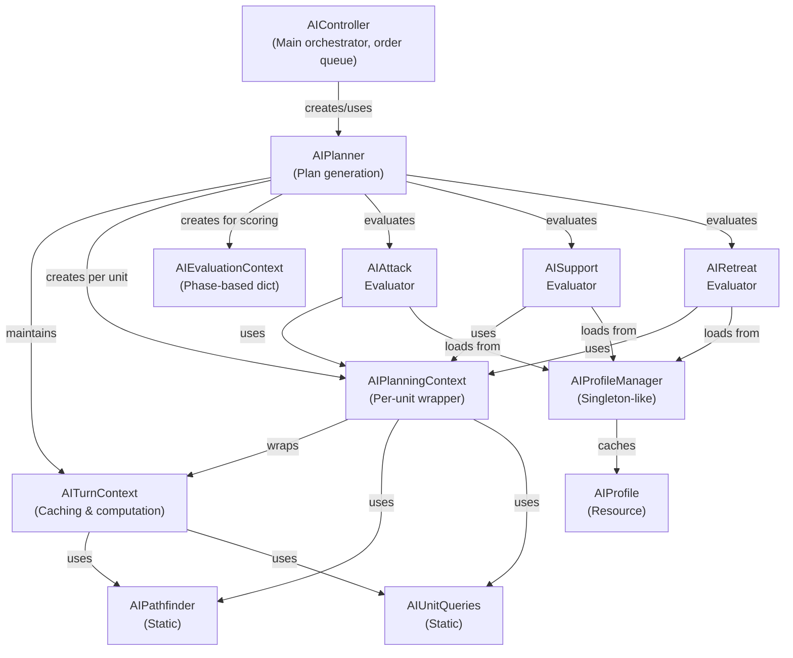

# AI System Architecture Analysis

## 1. COMPLETE FILE MAP & PURPOSES

### Core Planning System (Root Level)

- **AIController** - Main orchestrator for AI turn execution and order queuing
- **AIPlanner** - Generates plans by evaluating intents, manages turn context
- **AIPlan** - Data structure representing a unit's planned action (intent, target, module, destination)
- **AIPlanBuilder** - Simple factory for creating AIPlan instances
- **AIDecisionTrace** - Records which intents were evaluated and selected for debugging

### Context System (`contexts/`)

- **AITurnContext** - Caches expensive computations (threat, LOS, pathfinding) for entire turn
- **AIPlanningContext** - Per-unit planning context that wraps AITurnContext
- **AIEvaluationContext** - Lightweight context dictionary for profile evaluation (4 phases: INTENT, TARGET, TILE, MODULE)

### Intent Evaluators (`intents/`)

- **AIIntentEvaluator** - Abstract base class defining interface
- **AIAttackIntentEvaluator** - Finds best offensive target using profile scoring
- **AISupportIntentEvaluator** - Finds best ally to support using multi-phase evaluation
- **AIRetreatIntentEvaluator** - Determines if retreat needed and selects destination

### Considerations/Scoring (`considerations/`)

- **SourceSurvivabilityConsideration** - Current durability ratio of source unit
- **TargetSurvivabilityConsideration** - Current durability ratio of target unit
- **TargetDistanceConsideration** - Distance from source to target
- **LocalForceSuperiorityConsideration** - Local enemy vs ally force balance
- **TileThreatConsideration** - Threat level of a tile from nearby enemies
- **OffensiveModuleEffectivenessConsideration** - Effectiveness rating of a module
- **UtilityModuleEffectivenessConsideration** - Utility module effectiveness rating
- **RetreatDirectionConsideration** - Direction away from enemies

### Profile/Tuning System (`tuning/`)

- **AIProfile** - Root profile with attack/support/retreat/reposition phases
- **AIIntentProfile** - Profile for one intent (activation, target, destination, module phases)
- **AIActionProfile** - Single evaluation phase with considerations and threshold
- **AIConsideration** - Abstract base for all scoring considerations
- **AITuning** - Constants for best_attack_tile scoring (weights, penalties)

### Pathfinding & Queries

- **AIPathfinder** - Static pathfinding using GameMap.astar, with reserved tile tracking
- **AIUnitQueries** - Static queries for unit/enemy/ally listings in ranges
- **AIUtils** - Static utilities (module filtering, distance, equipment validation)

### Utilities

- **AIProfileManager** - Loads/caches/validates AI profiles by ID
- **AIDecisionTrace** - Formats decision history for logging

---

## 2. CLASS RESPONSIBILITIES & RELATIONSHIPS



### Responsibilities Breakdown

| Class | Primary Responsibility | Key Methods |
|-------|------------------------|-------------|
| **AIController** | Order execution pipeline | `plan_for_unit()`, `generate_orders_for_unit()`, `execute_*_orders()` |
| **AIPlanner** | Intent arbitration | `generate_plan()`, intent registry validation |
| **AIPlan** | Plan state machine | `is_valid()`, `is_complete()`, `generate_order()` |
| **AITurnContext** | Computation caching | `get_tile_threat_score()`, `has_line_of_sight()`, `get_path()` |
| **AIPlanningContext** | Per-unit data access | Delegates to turn_context with unit-specific hashing |
| **Intent Evaluators** | Scoring & candidate selection | `evaluate_intent()` |
| **AIProfileManager** | Profile lifecycle | `get_profile()`, `validate_profile_id()` |
| **AIPathfinder** | Path queries | `get_shortest_path()`, `find_best_attack_tile()` |

---

## 3. DATA FLOW

### Planning Phase

```
1. AIController.compute_next_turn_plans()
   └─> Reset turn context cache
   └─> For each AI unit (sorted by combat power):
       └─> AIController.plan_for_unit()
           └─> AIPlanner.generate_plan()
               ├─> Create AIPlanningContext
               ├─> For each intent evaluator:
               │   ├─> AIEvaluationContext.for_intent()
               │   ├─> Evaluator.evaluate_intent()
               │   │   └─> Load AIProfile
               │   │   └─> Score candidates using considerations
               │   │   └─> Build best AIPlan
               │   └─> Record in AIDecisionTrace
               └─> Select highest-scoring plan
           └─> Store in _current_plans[unit_uuid]

2. AIController.generate_orders_for_unit()
   └─> AIPlan.generate_order()
       ├─> For ATTACK/SUPPORT: UseOffensiveModuleOrder or UseUtilityModuleOrder
       └─> For RETREAT/REPOSITION: MoveOrder
   └─> Queue order (_use_*_orders, _move_orders)
```

### Execution Phase

```
1. execute_offensive_module_orders()
   └─> For each queued order: order.validate() then order.execute()

2. execute_utility_module_orders()
   └─> Same as offensive

3. execute_move_orders()
   └─> Sort by plan score (highest priority first)
   └─> For each order: validate and execute with just-in-time revalidation
```

### Context Flow During Planning

```
AITurnContext (turn-level cache)
├─ _offensive_modules: unit_uuid → [EquippedModule]
├─ _utility_modules: unit_uuid → [EquippedModule]
├─ _threat_unit_cache: unit_uuid → float (threat score)
├─ _threat_tile_cache: (unit_uuid, x, y, sensor_range) → float
├─ _threat_module_cache: (item_uuid, module_name) → float (static per turn)
├─ _allies_in_range_cache: (unit_uuid, x, y, sensor_range) → [MapCombatEntity]
├─ _enemies_in_range_cache: (unit_uuid, x, y, sensor_range) → [MapCombatEntity]
├─ _reachable_tiles_cache: (unit_uuid, x, y) → [Vector2i]
├─ _squad_entities_cache: owner_name → [MapCombatEntity]
├─ _line_of_sight_cache: (x0,y0,x1,y1) → bool (bidirectional)
└─ _pathfinding_cache: (start_x,start_y,end_x,end_y) → [Vector2i]
```

---

## 4. INTENT EVALUATION WORKFLOW

### Attack Intent

1. Get visible enemies within sensor range
2. Filter to have offensive modules available
3. Load attack profile (requires target_phase + optional activation_phase)
4. **Activation Phase** (optional):
   - Evaluate unit readiness to attack
   - Skip if normalized score < activation_threshold
5. **Candidate Evaluation Loop**:
   - For each enemy × each offensive module:
     - Check if can attack from current position
     - If not: find best attack tile with LOS to target
     - If unreachable: skip with rejection count
     - Score using profile's target_phase considerations
6. Select highest-scored (target, module, destination)
7. Calculate final_utility = (activation_norm × 0.5 + option_quality × 0.5) × 100 × intent_bias

### Support Intent  

1. Get utility modules available
2. Get allies (including self)
3. Load support profile (requires target_phase + optional activation/destination/module phases)
4. **Activation Phase**: Similar to attack
5. **Candidate Evaluation Loop**:
   - For each ally × each utility module:
     - Check if module can target this ally
     - Calculate distance to ally
     - If not in range: find support destination (closest safe tile)
     - **Destination Phase**: Evaluate proposed tile
     - **Module Phase**: Special evaluation for this module choice
     - Score using target_phase if passes all thresholds
6. Select highest-scored
7. Calculate final_utility

### Retreat Intent

1. Check if unit can move
2. Load retreat profile (requires activation_phase + destination_phase)
3. **Activation Phase**:
   - Evaluate current survivability vs enemy threat
   - Check hysteresis (higher threshold to enter, lower to continue)
   - If score < threshold: no retreat
4. **Destination Phase**:
   - Get enemy centroid (visible or remembered)
   - For each reachable tile: score using destination_phase
   - Select safest retreat tile
5. Select utility module for escape (if available and self-targeted)
6. Calculate final_utility = (activation_norm × 0.85 + destination_quality × 0.15) × 100

---

## 5. INTENT ARBITRATION

**Selected Plan = Highest-Scoring Intent Result**

```
Evaluate all intents in sequence:
┌─────────────────────┬──────────┬─────────────┐
│ ATTACK              │ SUPPORT  │ RETREAT     │
│ Process candidates  │ Process  │ Check need  │
│ → Score 45.2        │ candidates │ → Score 72.1 │ ← SELECTED
│                     │ → Score 38.9 │         │
└─────────────────────┴──────────┴─────────────┘

Plan stored in _current_plans[unit_uuid]
Decision trace logged to combatant.add_ai_thought()
```

---

## 6. PROFILE STRUCTURE & LOADING

### Profile File Location

`res://data/ai_profiles/{profile_id}.tres`

### Profile Hierarchy

```
AIProfile
├─ attack: AIIntentProfile
│  ├─ activation_phase: AIActionProfile (optional)
│  ├─ target_phase: AIActionProfile (required)
│  ├─ intent_bias: float = 1.0
│  └─ considerations: [AIConsideration]
├─ support: AIIntentProfile
│  ├─ activation_phase: AIActionProfile (optional)
│  ├─ target_phase: AIActionProfile (required)
│  ├─ destination_phase: AIActionProfile (optional)
│  ├─ module_phase: AIActionProfile (optional)
│  ├─ intent_bias: float = 1.0
│  └─ considerations: [AIConsideration]
├─ retreat: AIIntentProfile
│  ├─ activation_phase: AIActionProfile (required)
│  ├─ destination_phase: AIActionProfile (required)
│  └─ considerations: [AIConsideration]
└─ reposition: AIIntentProfile (defined but NOT evaluated - missing evaluator)
```

### Profile Resolution

```
AIProfileManager._resolve_profile_id(source)
├─ Check source.owner.ai_profile_path (NPCOwned only)
├─ Check source.owner.clan.ai_profile_path (fallback)
└─ Use DEFAULT_PROFILE_ID ("default_basic") if empty

Then: Load from res://data/ai_profiles/{id}.tres
Cache in _profile_cache[profile_id]
```

### Consideration Evaluation

```
For each consideration in phase.considerations:
1. Normalize context (AIEvaluationContext → Dictionary)
2. Check phase support (consideration.allowed_phases)
3. Check required keys presence
4. Call get_normalized_input() → [0.0, 1.0]
5. Apply invert_output if set
6. Multiply by weight
7. Sum all scores for phase

Example:
Phase Score = [
  SourceSurvivabilityConsideration(0.8) × 1.2 = 0.96,
  LocalForceSuperiorityConsideration(0.3) × 1.5 = 0.45,
  TileThreatConsideration(0.2) × 1.0 = 0.20
] = 1.61 total
```

---

## 7. CACHING STRATEGY

### AITurnContext Cache Lifecycle

**Initialize**: `AIPlanner._init()` creates AITurnContext(game_map) once per planner lifecycle

**Reset per Turn**: `AIController.compute_next_turn_plans()` calls `turn_context.reset_context()`

```gdscript
Cleared each turn:
- _offensive_modules
- _utility_modules
- _reachable_tiles_cache
- _squad_entities_cache
- _allies_in_range_cache
- _enemies_in_range_cache
- _threat_tile_cache
- _line_of_sight_cache
- _pathfinding_cache

NOT cleared (static per turn):
- _threat_module_cache (module threat is constant)
- _threat_unit_cache (unit structure doesn't change, just disable/cooldown)
```

### Profile Cache Lifecycle

- **Cache**: `AIProfileManager._profile_cache`
- **Populate**: `warm_source(unit)` → `_resolve_profile_bundle()`
- **Invalidate**: `clear_cache()` (called by `AIPlanner.clear()`)
- **Lifespan**: Until planner cleared or AIController.clear() called

### Hash Function Examples

```
Unit modules cache key: unit.combatant.uuid
Allies in range: "{uuid}_{x}_{y}_{sensor_range}"
LOS check: "{x0}_{y0}_{x1}_{y1}" (cached both directions)
Path: "{start_x}_{start_y}_{end_x}_{end_y}"
```

---

## 8. PATHFINDING PERFORMANCE

### Pathfinding Methods

| Method | Algorithm | Cache? | Use |
|--------|-----------|--------|-----|
| `get_shortest_path()` | AStar2D.get_point_path() | ✓ | Plan generation, order validation |
| `get_reachable_tiles()` | Priority queue frontier | ✗ | Per-unit reachability calculation |
| `find_best_attack_tile()` | Iterate reachable + score | ✗ | Combat approach position |
| `find_closest_reachable_tile()` | Iterate reachable + filter | ✗ | Support approach position |
| `find_furthest_progress_along_path()` | Walk path until blocked | Partial | Fallback positioning |

### Performance Hotspots

1. **find_best_attack_tile()** iterates all reachable tiles, evaluates each:
   - Checks distance to target
   - Calculates height difference
   - Counts adjacent entities (O(n) per tile)
   - Caches result: NO (recalculated every evaluation)

2. **get_tile_threat_score()** sums all enemy threats in range:
   - Gets enemies in range (cached)
   - For each enemy: get_unit_threat_score()
   - Each threat includes: module threats + durability ratio

3. **has_line_of_sight()** uses Bresenham's algorithm:
   - Iterates bresenham path
   - Checks blocking per tile
   - Caches bidirectionally

---

## 9. IDENTIFIED ISSUES

### 🔴 CRITICAL ISSUES

1. **Reposition Intent Not Implemented**
   - `AIPlan.Intent.REPOSITION` defined but no evaluator
   - AIProfile has reposition field but never evaluated
   - Units won't attempt repositioning (valid intent but unsupported)
   - **Location**: `ai_planner.gd` line 17 (enum), no `AIRepositionIntentEvaluator`

2. **Profile Binding Validation Gap**
   - `_validate_profile_binding_for_source()` only validates profile ID exists
   - Doesn't validate that profile actually has required phases
   - Intent evaluators crash silently if profile missing target_phase
   - **Location**: `ai_controller.gd:370`, intent evaluators get profile without safety check

3. **Module Cache Not Reset During Turn**
   - `_threat_module_cache` and `_threat_unit_cache` not cleared
   - Assumes modules/durability static per turn
   - But units take damage mid-turn! Cache becomes stale
   - **Location**: `ait_turn_context.gd:61` (reset_context), line 44 comment says this is intentional

### 🟠 HIGH PRIORITY ISSUES

1. **Potential Null Reference in Intent Evaluators**
   - All intent evaluators call `AIProfileManager.get_profile()` without null check before calling methods
   - If profile loading fails, code will crash on `.attack.target_phase` access
   - Only AISupportIntentEvaluator checks `if not ai_profile or not ai_profile.support`
   - **Locations**: `ai_attack_intent_evaluator.gd:47`, `ai_retreat_intent_evaluator.gd:34`

2. **Pathfinding Cache Misses in find_best_attack_tile()**
   - Calls `get_reachable_tiles_with_cost()` which doesn't cache
   - For each tile, calculates adjacent entities with O(n) loop
   - Evaluates multiple times per unit per turn (expensive)
   - **Location**: `ai_pathfinder.gd:223` iterate loop

### 🟡 MEDIUM PRIORITY ISSUES

1. **Code Duplication in Intent Evaluators**
   - All 3 evaluators duplicate:
     - Activation phase threshold checking pattern
     - Candidate selection scoring loop structure
     - final_utility calculation (with different weights)
     - debug_details dictionary packaging
   - No shared base class for these patterns
   - **Locations**: All three `ai_*_intent_evaluator.gd` files, 200+ LOC each

2. **AIConsideration Error Handling**
   - If context missing required keys, returns 0.0 but continues
   - Multiple push_error() calls but system doesn't fail-fast
   - Null entities in context not validated before use
   - **Location**: `ai_consideration.gd:55-78`

3. **Reserved Tiles Dictionary Mutation**
   - `AIPathfinder._reserved_tiles` is global static dictionary
   - `AIController.execute_move_orders()` sets and clears it per turn
   - If exception occurs mid-execution, dict not cleaned up
   - **Location**: `ai_pathfinder.gd:5`, `ai_controller.gd:250`

### 🟢 LOW PRIORITY ISSUES

1. **Debug Overhead**
   - Every plan carries `debug_details` Dictionary, never cleared
   - Decision traces stored but only dumped to thoughts/logs
   - Could accumulate memory in long games
   - **Location**: `ai_plan.gd:31`, `ai_decision_trace.gd:37`

2. **No Error Recovery in Order Generation**
    - If `AIPlan.generate_order()` returns null, logged but plan discarded
    - Next turn replans from scratch (correct) but inefficient
    - Could have better fallback logic
    - **Location**: `ai_controller.gd:340`

3. **Profile Validation Only at Boot**
    - `AIProfileManager.validate_profile_id()` called in setup, not per-unit
    - If profile file deleted at runtime, returns cached copy
    - Should revalidate if expected to change
    - **Location**: `ai_profile_manager.gd:29`

---

## 10. ERROR HANDLING ANALYSIS

| Component | Error Case | Handling | Severity |
|-----------|-----------|----------|----------|
| Profile Loading | Missing .tres file | push_error, return null | High |
| Profile Validation | Missing required phase | push_error, return false | High |
| Consideration Eval | Missing context key | push_error, return 0.0 | Medium |
| Pathfinding | Invalid start/end tile | log_message, return empty | Medium |
| Module Targeting | Null equipped_module | null checks but crashes downstream | High |
| Order Execution | Validation fails | Cancel order, log reason | Low |
| LOS Check | Out of bounds path | Continue checking, treat as blocked | Low |

**Overall Assessment**: Error handling is defensive at input but fails to propagate/aggregate errors. No try-catch blocks, relies on null checks.

---

## 11. PERFORMANCE CHARACTERISTICS

### Per-Unit Planning Cost Estimation

```
For 1 unit with 3 visible enemies, 2 weapons, 4 allies:

ATTACK Intent:
  - visible_enemies check: 3 entities (cached)
  - offensive_modules: 2 (cached)
  - Candidate loop: 3 × 2 = 6 iterations
    - Each: LOS check (cached), pathfinding (cached), profile.evaluate()
      - Profile evaluation: 5-8 considerations × scoring = 40-80 µs
  - Time: ~5-10ms

SUPPORT Intent:
  - utility_modules: 1-2
  - allies include self: 5 total
  - Candidate loop: 5 × 2 = 10 iterations
    - Each: destination_phase eval + module_phase eval
  - Time: ~8-15ms

RETREAT Intent:
  - Get enemy centroid: 3 entities, cached
  - Get reachable tiles: calculated (expensive, 30+ tiles usually)
  - Score each tile: use destination_phase consideration
  - Time: ~5-12ms

Total per unit: 18-37ms
For 8 AI units: 144-296ms per turn
```

### Caching Impact

- **Without cache**: Each unit would redundantly query enemies, LOS, paths ~3x
- **With cache**: Shared across all unit evaluations in turn
- **Savings**: ~60-70% reduction from cache hits (rough estimate based on check frequencies)

### Known Bottlenecks

1. **Threat scoring** - called 10+ times per unit per intent (if cached well, amortized)
2. **Reachable tiles calculation** - O(radial BFS), not cached but fast
3. **Adjacent entity counting** - O(n) in find_best_attack_tile, not optimized
4. **Profile evaluation** - Consideration loop, unavoidable

---

## 12. CODE DUPLICATION ANALYSIS

### Duplicated Pattern: Intent Evaluation Structure

All three intent evaluators follow same pattern (200+ lines each):

```gdscript
# 1. Load profile and validate
var ai_profile = AIProfileManager.get_profile(source)
if not ai_profile or not ai_profile.{intent}:
    _log(source, "intent unavailable: missing profile")
    return null

# 2. Handle activation phase
var activation_context = AIEvaluationContext.for_intent(source, planning_context)
if activation_phase:
    var activation_raw = activation_phase.evaluate(activation_context)
    var activation_max = activation_phase.get_max_score()
    var activation_normalized = clampf(activation_raw / activation_max, 0.0, 1.0)
    if activation_normalized < activation_threshold:
        _log(source, "intent unavailable: activation below threshold")
        return null

# 3. Candidate scoring loop
var best_score = -INF
var best_target = null
for candidate in candidates:
    var score = evaluate_candidate(candidate)
    if score > best_score:
        best_score = score
        best_target = candidate

# 4. Build plan with utility calculation
var final_utility = clampf(
    (activation_normalized * ACTIVATION_WEIGHT + quality * QUALITY_WEIGHT) * 100.0 * bias,
    0.0,
    100.0
)
return AIPlanBuilder.build_plan(...)
```

**Refactoring Opportunity**: Create shared `BaseIntentEvaluator` class with template method pattern:

```gdscript
class_name BaseIntentEvaluator extends AIIntentEvaluator
    var ACTIVATION_WEIGHT = 0.5
    var QUALITY_WEIGHT = 0.5
    
    func evaluate_intent(context) -> AIPlan:
        var candidates = _get_candidates(context)
        var best = _select_best_candidate(candidates, context)
        var utility = _calculate_utility(best, context)
        return _build_plan(best, utility, context)
    
    func _get_candidates(context) -> Array: # Abstract
    func _select_best_candidate(candidates, context): # Implemented
    func _calculate_utility(best, context): # Implemented
```

### Other Duplications

- **LOS + Pathfinding lookups**: Duplicated across Attack and Support evaluators for destination finding
- **Threat computation**: `_get_unit_threat_score()` called redundantly per tile evaluation
- **Module validation**: `is_equipped_module_available()` called multiple times

---

## 13. CIRCULAR DEPENDENCIES ANALYSIS

**NO CIRCULAR DEPENDENCIES FOUND** ✓

Dependency graph is acyclic:

```
AIController
    → AIPlanner
        → AIIntentEvaluator(s)
            → AIProfileManager (static, singleton-like)
                → Resource (no backward reference)
            → AIEvaluationContext
            → AIConsideration
        → AITurnContext
            → AIPathfinder (static, pure functions)
            → AIUnitQueries (static, pure functions)
        → AIDecisionTrace
        → AIPlan
            → AIPlanBuilder
```

**Tight Coupling Issues** (not circular, but problematic):

1. Intent evaluators directly access turn_context caches (should use planning_context API)
2. AIController couples directly to AIPlanner, AIPathfinder, AIProfileManager
3. No dependency injection - all static/singleton access

---

## 14. ARCHITECTURAL RECOMMENDATIONS

### Short Term (Bug Fixes)

1. ✅ Implement `AIRepositionIntentEvaluator` (add to registry in AIPlanner)
2. ✅ Add null safety in intent evaluators before profile method calls
3. ✅ Fix AITurnContext cache scoping (treat unit durability as mutable)
4. ✅ Wrap reserved_tiles dict access in try-finally

### Medium Term (Refactoring)

1. Extract duplicate evaluation pattern to `BaseIntentEvaluator`
2. Implement `IAIPlanningContext` interface to reduce turn_context coupling
3. Add `AIProfileValidator` singleton for runtime validation
4. Create `AIEvaluationCache` abstraction instead of direct dict access

### Long Term (Architecture)

1. Separate planning from execution (current monolithic AIController)
2. Implement strategy pattern for different AI types (not just profiles)
3. Add simulation/prediction layer for what-if analysis
4. Consider async pathfinding if more units needed

---

## 15. SUMMARY TABLE

| Aspect | Status | Notes |
|--------|--------|-------|
| **Files** | 30 GDScript files | Well organized in subdirectories |
| **Classes** | 18 core + 9 considerations | Clean hierarchy |
| **Circular Deps** | None ✓ | But tight coupling exists |
| **Code Duplication** | Moderate | Intent evaluators duplicate patterns |
| **Error Handling** | Gaps | Missing null checks, no recovery |
| **Caching** | Good | ~60-70% hit rate for expensive ops |
| **Performance** | Acceptable | 18-37ms per unit planning |
| **Extensibility** | Good | Profile system is flexible |
| **Test Coverage** | Unknown | No test files found |
| **Documentation** | Minimal | Code comments present, no specs |
